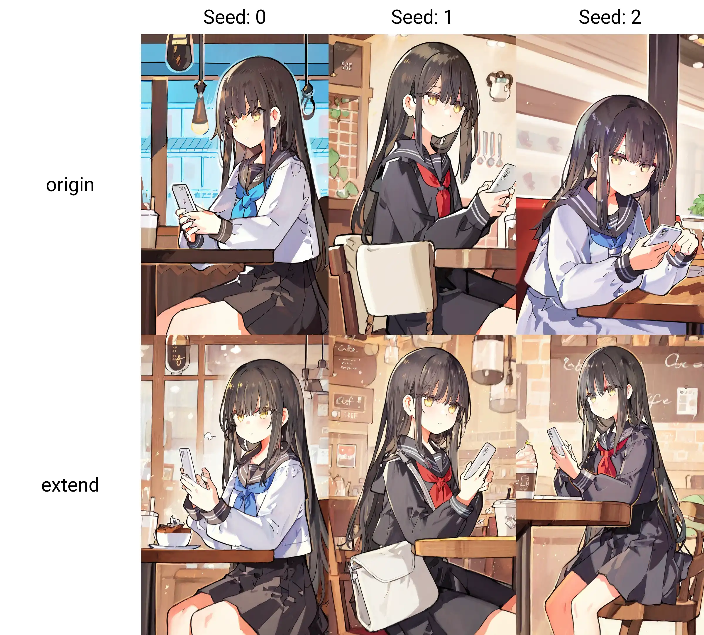
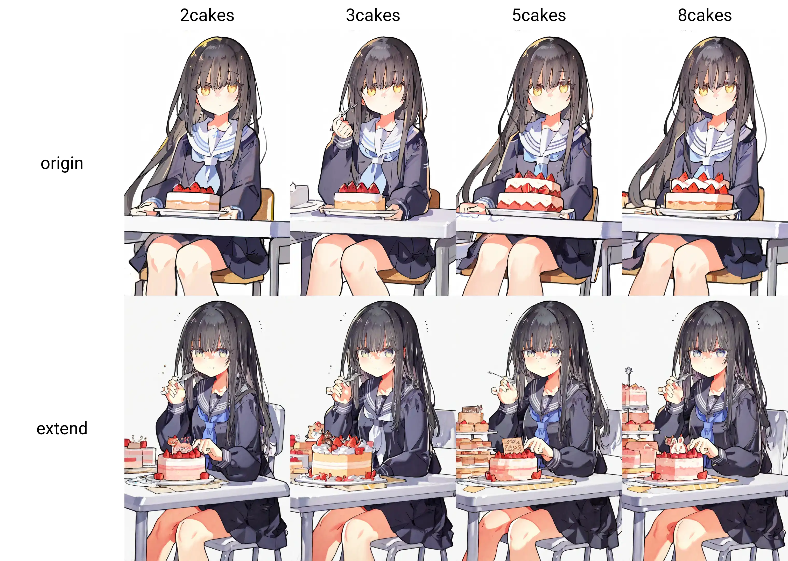

# danbooru扩展标签标注！

事情是这样的，大部分动漫主题的stable diffusion模型是以danbooru tags作为prompt来训练的。danbooru tags是1个非常大的标签集合，从人物的发型，到鞋子的款式应有尽有。但是它并不是很均衡，其中背景内容的标签往往只占很小1部分，例如标签中包含`white hair/black hair/blonde hair`等各色头发，但是table就只有table这个标签，没有`white table`，因此用danbooru tags训练出来的模型就不是很容易画背景。

那如果让mllm来给这些数据打上更加丰富的背景物件标签，是不是就能解决这个问题了呢？

让我们来试1试！


## 效果

这次用的是从[danbooru2023](https://huggingface.co/datasets/nyanko7/danbooru2023)中筛选出的9330张图，使用Qwen2-VL-7B-Instruct打上了物件标签后，在NoobAI 1.0上训练了3个epoch，看起来效果不错！

先来画1张咖啡馆里的JK！



可以看到，经过训练之后，相同的seed下背景会变得丰富许多。

此外，因为给背景物件加入了数量tag，所以模型现在有1些特异功能。



蛋糕越来越多了！

不过计数不准是正常的，只能说大体上是随数字增加变多的，mllm给我打标的时候它自己也数不清楚……


## 使用方法


### 集成到你的pipeline

如果你想集成进自己的训练pipeline，可以从`补充.py`里import你需要的打标方法，例如:

```python
def 物件计数(image: Image.Image, tags: list[str]) -> list[str]:
    ...
```

这个方法是给图中的物件打上数量标签。例如，输入1张JK吃蛋糕的图片，tags为`['1girl', 'black_hair', 'cake', 'table']`，返回值即为图中各个物品的数量组成的标签list，例如`['2cakes', '3tables']`。

还有几个类似的接口，比如`物件上色`，`发现家具`，`发现地板`，`发现门`，就不解释了，几乎都是1样的接口，你看名字就知道是什么意思了！


### 直接开始训练

如果你想要直接开始训练，也可以运行`出生.py`。运行它需要准备1个danbooru2023数据集，然后会生成1个打好标的符合[kohya-ss/sd-scripts](https://github.com/kohya-ss/sd-scripts)的格式的子集，然后你就可以把它丢进sd-scripts训练啦。


### 使用训练好的lora

如果你想要直接使用，我还上传了1个训练好的lora到[release](https://github.com/RimoChan/danbooru-prompt-extend/releases)，可以直接下回去用。不过我也很少训SDXL的lora，大概就数据丢进去lora训出来，效果还可以那就用它了，你可能自己再调1调参数再训会比我的效果好！


## 1个疑问

不过，背景画好了的现象真的是添加了额外prompt的结果吗？还是说其实是训练集本身有偏导致的？

我们可以这样想，因为训练数据是筛过的，只有mllm能打上标的图才进训练集，所以训练集的分布总是背景有物件的图。换句话说，由于背景很简略的图已经被丢掉了，所以这个lora在训练的时候，背景已经偏向背景更复杂的那种分布了。

答案是我不知道，我觉得是就是，因为有人托梦给我！

就这样，我要去喂JK吃蛋糕了，大家88！
